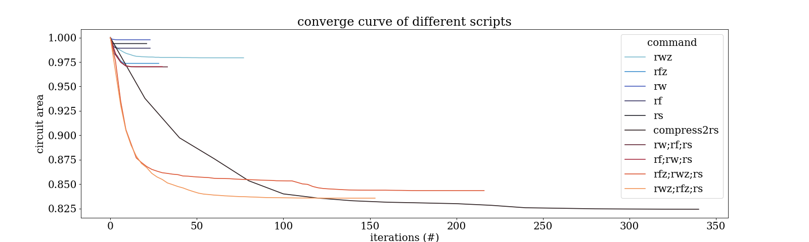

# ABC Playground

Play around with ABC commands on Public Benchmarks and record the result.
## Usage
first install dependencies
```
pip install -r reuqirement.txt
```
then please edit file `.env` and configure the absolute directory
```
ABC_DIR=<path/to/your/abc/executable>
EXP_HOME=<path/to/the/root/directory/of/ABC_playground>
```
run:
```
python experiments/e1.py
```

## Experiments

### e1


